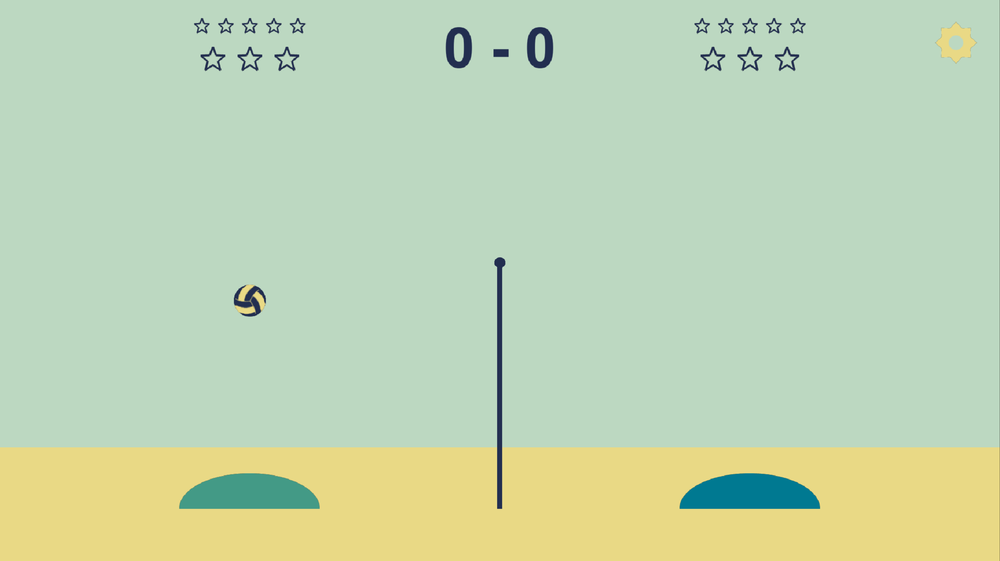

# Beach Slime Volleyball

Пляжный волейбол в стиле slime-volleyball на Python + pygame-ce.
Управление с клавиатуры и с любого геймпада, поддерживаемого SDL2:
Xbox, PlayStation (DualShock/DualSense), Switch Pro, Logitech F310
и другие XInput/DirectInput-контроллеры.



## Установка

Скачай готовый `BeachVolleyball.exe` со страницы релизов и запусти двойным кликом:

<https://github.com/yalyoha/Volleyball/releases/latest>

Ничего дополнительно ставить не нужно — Python и зависимости уже упакованы в exe.

### Запуск из исходников (для разработки)

```
pip install -r requirements.txt
python volleyball.py
```

Требуется Python 3.10+ и pygame-ce.

## Настройки

Значок шестерёнки в правом верхнем углу открывает экран настроек, где
можно выбрать режим ввода — **Auto** (геймпад если подключён, иначе
клавиатура), **Gamepad** или **Keyboard** — и посмотреть карту кнопок.

## Управление

**Геймпад** (логические кнопки, работают на всех поддерживаемых SDL2 контроллерах):

| Действие  | Кнопка                                                     |
| --------- | ---------------------------------------------------------- |
| Движение  | Левый стик / D-Pad                                         |
| Прыжок    | A (Xbox) / ✕ (PlayStation) / B (Switch)                    |
| Пауза     | Start / Options / +                                        |
| Рестарт   | Back / Share / −                                           |

Первый подключённый геймпад = игрок 1 (красный, слева),
второй = игрок 2 (синий, справа).
Для Logitech F310 переключатель на задней стенке должен быть в положении `X` (XInput).

**Клавиатура** (fallback, если геймпадов нет):

| Игрок | Влево | Вправо | Прыжок |
| ----- | ----- | ------ | ------ |
| 1     | A     | D      | W      |
| 2     | ←     | →      | ↑      |

- `P` — пауза
- `R` — рестарт
- `Enter` — рестарт после матча
- `F11` / `F` — полноэкранный режим (переключение)
- `Esc` — выход из полноэкранного режима, затем выход из игры

## Правила

- Игра до 7 очков.
- Если мяч упал на вашу половину поля — очко сопернику.
- После очка — подача проигравшим.
